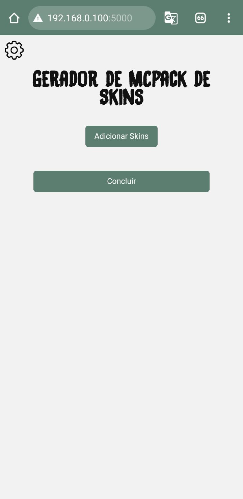

# Gerador-de-Skins

Este é um projeto no qual tenho trabalhado há algum tempo no meu celular.
Ele é um gerador de pacotes de skins simples que, para mim, tem sido o mais funcional e intuitivo.
Ainda estou trabalhando nele e pensando em outros recursos que poderia adicionar.

Esta imagem mostra a tela padrão onde tudo acontece.
Nela, há três botões: uma engrenagem e dois botões verdes com os textos 'Adicionar Skin' e 'Concluir' (sendo este o maior botão).

Vamos começar por partes: a engrenagem!

**A engrenagem abre um painel com algumas opções de customização, incluindo:**  
- **Linguagem:** Define o idioma do arquivo `lang`.  
- **Manifesto:** Contém informações sobre o pacote.  
  - **Autor:** Meu nick do Minecraft.  
  - **Nome:** Nome do pacote dentro do jogo.  
  - **Descrição:** Texto descritivo do pacote (sem utilidade e possivelmente removido futuramente).  
- **Skins:** Ainda incompleto.  

voltando ao menu: botão Adicionar Skins!

no celular quando apertado aparecera uma tela

